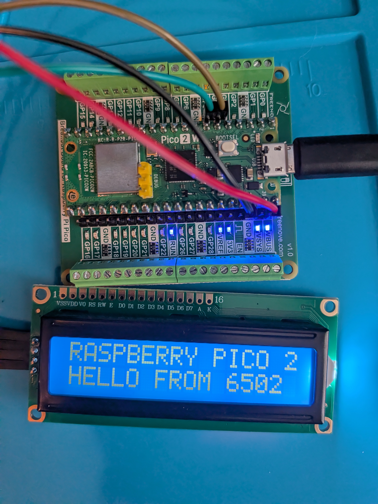

# Pico 6502

A small 6502 computer inside a Raspberry Pi Pico 2. The Pico emulates a 6502 CPU
using [Fake6502](https://github.com/ivop/fake6502), with 64K of RAM and a
[Freenove I2C LCD1602](https://docs.freenove.com/projects/fnk0079/en/latest/)
16x2 display. You can type machine code straight into memory from a serial
terminal, or assemble programs on your PC and upload them over USB. Programs drive
the LCD by writing to memory-mapped registers.

<p align="center">
  
</p>

```
6502 assembly ──64tass──▶ .bin ──tools/upload.py (USB)──▶ monitor ──▶ Fake6502 CPU ──▶ $F000 registers ──I²C──▶ LCD
                     or type bytes with the monitor's w command ──┘
```

## Layout

| Path | What |
|---|---|
| `src/fake6502/` | Fake6502 CPU core (BSD-2), lightly modified (see below) |
| `src/bus.c` | 64K memory map and I/O registers (`read6502`/`write6502`) |
| `src/lcd.c` | 16x2 display logic: cursor tracking, row wrapping, text mirror |
| `src/monitor.c` | USB serial monitor: loader, run/stop, step, breakpoint, speed limit |
| `src/disasm.c` | 6502 disassembler used by the monitor's `r`, `s` and `u` |
| `src/pico/` | Pico-only code: `main.c`, and `lcd_pcf8574.c` (I²C display driver) |
| `src/demo_program.h` | Built-in demo, generated from `asm/hello.asm` |
| `host/` | PC simulator (`sim6502`), the CPU test suites and the disassembler test |
| `asm/` | Example programs and `lcd6502.inc` register definitions |
| `images/` | Photos for this README |
| `tools/upload.py` | Uploads a program to the Pico (or the simulator) |
| `tools/selftest.py` | Automated checks against the Pico (or the simulator) |
| `tools/bin2c.py` | Turns a `.bin` into `src/demo_program.h` (used by `make demo` in `asm/`) |
| `tools/setup-toolchain.sh` | Installs the build tools into `../6502-Pico-Build` |
| `tools/build-firmware.sh` | Builds the firmware with those tools |

Everything except `src/pico/` is plain C, so the PC simulator runs the same
monitor, bus and CPU code as the firmware.

## Hardware

The display is a Freenove I2C LCD1602 (see Freenove's
[Pico wiring guide](https://docs.freenove.com/projects/fnk0079/en/latest/fnk0079/codes/Raspberry_Pi_Pico/Raspberry_Pi_Pico_C/1_LCD1602.html)).
The module's I²C chip is a PCF8574T (address `0x27`) or a PCF8574AT (address
`0x3F`). Some versions have the chip under a black blob instead of a visible
package, but they work the same way. The firmware tries both addresses, plus the
`0x20–0x26` and `0x38–0x3E` addresses you get by soldering the A0–A2 pads. The
monitor's `d` command shows which address answered.

| Pico 2 | LCD1602 module |
|---|---|
| VBUS (pin 40) | VCC |
| GND (pin 38) | GND |
| GP4 (pin 6) | SDA |
| GP5 (pin 7) | SCL |

- **Power the module from 5 V.** Freenove states that the LCD1602 must run from
  5 V, because 3.3 V gives very low contrast. VBUS carries the 5 V from the Pico's
  USB cable. VSYS (pin 39) also works when the Pico is powered over USB. Don't use
  3V3 (pin 36).
- **The 5 V I²C lines are safe on a Pico 2.** The module's pull-up resistors hold
  SDA and SCL at 5 V. The RP2350 datasheet says its GPIOs are "5 V-tolerant
  (powered) and 3.3 V-failsafe (unpowered)". Powering the module from VBUS
  guarantees the Pico is always on when the module is. On an original Pico
  (RP2040), whose pins are not 5 V-tolerant, use an I²C level shifter.
- **If the backlight is on but no text shows,** slowly turn the contrast
  potentiometer on the back of the module. Versions without one have their
  contrast set at the factory. Contrast and brightness can't be changed from
  software; the backlight can only be switched on and off (`$F004`).
- **Wire the display with the Pico unplugged.** The firmware looks for the display
  at power-up; the monitor's `i` command looks again without a replug.

The pins, I²C speed and candidate addresses are set at the top of
`src/pico/lcd_pcf8574.c`.

**If `d` says `display NOT DETECTED`,** unplug the Pico, check the wiring, plug it
back in, and type `i` at the monitor prompt. It reports each line's state:

| `i` reports | Meaning |
|---|---|
| SDA and SCL high, display found | All good |
| SDA and SCL high, no devices | Module powered and wired, but at an unexpected address, or SDA/SCL swapped |
| LOW, and "reads high" with the Pico's pull-up | Nothing is connected to that pin: check it goes to GP4 (pin 6) or GP5 (pin 7) |
| LOW, and still "LOW" with the Pico's pull-up | The module has no power (check VCC to VBUS pin 40, and GND), or the line is shorted to ground |

Physical pins are numbered from pin 1, at the USB end of the board, with the
component side up: pins 1–20 run down the left edge and 21–40 back up the right,
so VBUS (pin 40) sits opposite pin 1.

**Only the USB cable is needed.** The monitor, uploads and program serial I/O all
use the Pico's USB serial port. The firmware doesn't use the Pico's hardware UART,
so a Debug Probe's UART wires are unnecessary, though leaving them connected does
no harm. A Debug Probe is still handy for flashing and debugging over SWD without
pressing BOOTSEL.

## Building and flashing the firmware

The build needs the Arm GNU toolchain, CMake, the
[Pico SDK](https://github.com/raspberrypi/pico-sdk) 2.x and picotool.
`tools/setup-toolchain.sh` downloads all of them, plus the 64tass assembler, into
a folder next to the project, `../6502-Pico-Build`. Nothing is installed
system-wide, and the folder stays outside the git repository.

```sh
tools/setup-toolchain.sh          # once: about 1 GB into ../6502-Pico-Build
tools/build-firmware.sh           # builds ../6502-Pico-Build/build/pico6502.uf2
```

Both scripts accept a different folder as an argument, and re-running
`setup-toolchain.sh` skips anything already installed. picotool is built without
USB support; the build only uses it to create the `.uf2`. To run the tools
yourself, for example 64tass or `make test-disasm`, load the environment first:

```sh
. ../6502-Pico-Build/env.sh       # sets PATH and PICO_SDK_PATH
```

With a Pico SDK you already have, `cmake -B build && cmake --build build` with
`PICO_SDK_PATH` set works too, as does the official Raspberry Pi Pico VS Code
extension.

To flash, put the Pico 2 into its bootloader so that an `RP2350` drive appears.
Either hold BOOTSEL while plugging it in, or, once this firmware is installed,
open its serial port at 1200 baud:

```sh
stty -F /dev/serial/by-id/usb-Raspberry_Pi_Pico_*-if00 1200
```

Copy `pico6502.uf2` to the `RP2350` drive. The Pico restarts, runs the built-in
demo, and the LCD shows:

```
RASPBERRY PICO 2
HELLO FROM 6502
```

On a Pico 2, the onboard LED stays lit while a 6502 program runs. The firmware
also runs unchanged on a Pico 2 W, as in the photo above, but there the LED doesn't
light: on the W it's wired to the wireless chip rather than GPIO 25.

## Connecting over USB

The Pico appears as a USB serial port with vendor/product ID `2e8a:0009`.

- **Port name:** `/dev/ttyACMn` numbers can change when devices are re-plugged,
  especially with a Debug Probe attached, which also creates a `ttyACM` port. The
  permanent name is under `/dev/serial/by-id/`, and looks like
  `usb-Raspberry_Pi_Pico_<serial>-if00`.
- **Permissions:** on Linux, opening the port needs membership of the `dialout`
  group. Run `sudo usermod -aG dialout $USER`, then log out and back in, or reboot.
  Until then, you can run a command with `sg dialout -c "command"`.
- **One program at a time:** use either a terminal or the Python tools. If both
  have the port open, they each receive part of the Pico's replies.

### Minicom

Install it with `sudo apt install minicom`. Create `~/.minirc.pico6502`, replacing
the port with your own `/dev/serial/by-id/` name:

```
pu port             /dev/serial/by-id/usb-Raspberry_Pi_Pico_E200D0666D3E4FA6-if00
pu baudrate         115200
pu bits             8
pu parity           N
pu stopbits         1
pu rtscts           No
pu xonxoff          No
pu minit
pu mreset
```

The empty `minit` and `mreset` lines stop Minicom sending modem commands (`ATZ`)
when it starts and exits. Hardware flow control is off because USB serial doesn't
use it. The baud rate is ignored over USB, but Minicom needs a value.

```sh
minicom pico6502
```

Press **Enter** for the `>` prompt.

| Keys | Action |
|---|---|
| Enter, Backspace, Ctrl-C | Go to the Pico; Ctrl-C stops a running program |
| Ctrl-A Q | Quit (choose **Yes** at "Leave without reset?") |
| Ctrl-A Z | Minicom help |

To enter a long program, you can paste lines of monitor commands with your
terminal window's paste (for example Ctrl-Shift-V).

### Python tools (pyserial)

Install pyserial with `sudo apt install python3-serial`. Both tools find the Pico by
its USB ID; `--port` picks a port explicitly.

```sh
python3 tools/upload.py asm/hello.bin                 # load at $0200, run
python3 tools/upload.py prog.bin --addr 8000          # another load address
python3 tools/upload.py prog.bin --addr 8000 --run 8100
python3 tools/upload.py image.bin --addr 0            # full 64K image: runs from its own reset vector
python3 tools/upload.py prog.bin --no-run
python3 tools/upload.py hello.prg                     # load address from the 2-byte .prg header

python3 tools/selftest.py                             # automated checks, no display needed
python3 tools/selftest.py --expect-lcd                # also require a detected display
```

`upload.py` stops any running program first. It sends each block with a CRC-16
checksum, and it skips the I/O page when an image covers it. The Pico checks the
address range and checksum before replying `OK`.

`selftest.py` uploads the example programs. It checks:
- loading and checksums,
- running and stopping, and serial I/O,
- breakpoints, stepping and disassembly,
- the LCD text, and with `--expect-lcd` that a display was detected,
- the 1 MHz speed limit.

It also runs the Klaus Dormann functional test, once `make test` in `host/` has
downloaded it. On a Pico 2 with the Freenove display, all 23 checks pass. The
speed measures about 999 kHz under the limit and about 2.6–2.9 MHz with no limit.
It leaves the hello demo running.

Pyserial also includes a basic terminal,
`python3 -m serial.tools.miniterm <port> 115200` (Ctrl-] quits), if you don't
want Minicom.

A typical workflow using both:

```sh
python3 tools/upload.py asm/echo.bin      # upload (Minicom closed)
minicom pico6502                          # watch and interact; Ctrl-A Q when done
```

## Monitor

The monitor runs on the Pico. It lets you inspect and change memory, enter and run
programs, and debug them.

- **Numbers:** hex, with an optional `$` (`w $0300 $A9`). The one exception is the
  speed in `t`, which is decimal.
- **Case:** commands and hex digits can be upper or lower case.
- **Lines:** up to 80 characters, so one `w` command can hold about 24 bytes.
  Backspace works while typing.
- **Running programs:** while a program runs, everything you type goes to the
  program, readable from `SERIAL_DATA`. **Ctrl-C** stops the program and returns
  to the prompt.
- **Replies:** commands answer `OK …` on success and `ERR …` on a mistake.

### Commands

| Command | Action |
|---|---|
| `h` or `?` | List the commands |
| `r` | Show registers: `PC A X Y SP`, the flags `NV-BDIZC` (letter = set, `.` = clear), and the next instruction, disassembled |
| `m ADDR [LEN]` | Dump LEN bytes (default 40 hex = 64) in hex and ASCII. Reading I/O registers here has no side effects |
| `w ADDR BB [BB..]` | Write bytes to ADDR, ADDR+1, … Writes to I/O registers take effect, for example `w F001 41` prints `A` on the LCD |
| `g [ADDR]` | Reset the CPU and run from ADDR. ADDR is also stored as the reset vector (`$FFFC`), so a later `g` or `x` restarts the same program. Without ADDR, runs from the current reset vector |
| `c` | Continue from the current PC without resetting, for example after a breakpoint or Ctrl-C |
| `s [N]` | Execute N instructions (default 1, hex), showing the registers and next instruction after each. Ctrl-C interrupts a long run |
| `u [ADDR [N]]` | Disassemble N instructions (default 10 hex = 16) from ADDR. `u` alone continues after the last listing, or starts at PC once registers have been shown. A single number is the address: `u 4` lists from `$0004` |
| `x` | Reset the CPU (PC from the reset vector, A=X=Y=0, SP=FD, I set) without running |
| `b [ADDR]` | Set the breakpoint at ADDR; it must be the first byte of an instruction. With no argument, show it |
| `b -` | Clear the breakpoint |
| `t [KHZ]` | Show or set the speed limit in decimal kHz. The default 1000 matches a stock 6502; `t 0` means no limit |
| `d` | Show the LCD's text, cursor position, backlight state and display I²C address. Works without a display attached |
| `i` | Troubleshoot the display: report whether SDA and SCL are high, as an idle I²C bus should be, list every I²C address that answers, and look for the display again. Clears the screen |
| `l ADDR LEN CRC` | Receive LEN raw bytes into memory; used by `upload.py` |
| Ctrl-C | Stop the running program |

Disassembly shows each instruction's bytes, then the instruction. Addresses of I/O
registers get a comment with the register's name, as in
`8D 01 F0  STA $F001  ; LCD_DATA`. Branches show their target address. Opcodes
that aren't documented 6502 instructions show as `???`.

A running program also stops by itself, printing where it stopped and how many
cycles it ran:
- **Breakpoint:** it reached the breakpoint address.
- **`BRK` with no handler:** it executed `BRK` (`$00`) while the IRQ/BRK vector at
  `$FFFE` is `$0000`. That's the case unless your program sets one, so `BRK` makes
  a handy "end of program". It also catches runaway programs that fall into
  empty, zero-filled memory.
- **Endless loop:** an instruction jumped or branched to itself, such as
  `done: JMP done`.

Memory is RAM: it survives `g`, `x` and Ctrl-C, but not unplugging or resetting the
Pico. After a power-up it is all zeros except the built-in demo at `$0200`.

### Example 1: look at the built-in demo

The demo runs at power-up. Connect, press Enter, then:

```
> d
+----------------+
|RASPBERRY PICO 2|
|HELLO FROM 6502 |
+----------------+
Cursor row 1 col 15, backlight on, display at I2C address 27
> r
PC=0222 A=00 X=FF Y=0F SP=FF P=..-..IZ.  4C 22 02  JMP $0222
```

The program has finished and is sitting at its `JMP $0222` loop. Without a display,
the last line of `d` says `display NOT DETECTED`. To see the demo's code:

```
> u 0200 9
0200  78        SEI
0201  D8        CLD
0202  A2 FF     LDX #$FF
0204  9A        TXS
0205  A9 01     LDA #$01
0207  8D 00 F0  STA $F000  ; LCD_CONTROL
020A  A9 36     LDA #$36
020C  A0 02     LDY #$02
020E  20 25 02  JSR $0225
```

Typing `u` on its own continues with the next 16 instructions.

### Example 2: type in a program that writes on the LCD

Programs can be entered straight into memory as machine code, with no assembler or
uploader. This one clears the display and prints `HI`:

| Address | Bytes | Instruction | Meaning |
|---|---|---|---|
| `0300` | `A9 01` | `LDA #$01` | A = 1 |
| `0302` | `8D 00 F0` | `STA $F000` | clear the LCD (`LCD_CONTROL`) |
| `0305` | `A9 48` | `LDA #$48` | A = `'H'` |
| `0307` | `8D 01 F0` | `STA $F001` | print it (`LCD_DATA`) |
| `030A` | `A9 49` | `LDA #$49` | A = `'I'` |
| `030C` | `8D 01 F0` | `STA $F001` | print it |
| `030F` | `4C 0F 03` | `JMP $030F` | stop here forever |

Multi-byte addresses are stored low byte first, so `STA $F000` is `8D 00 F0`.
After typing the bytes, `u` reads them back as instructions, which is the quickest
way to catch a typing mistake.

```
> w 0300 A9 01 8D 00 F0 A9 48 8D 01 F0 A9 49 8D 01 F0 4C 0F 03
OK wrote 18 bytes
> u 0300 7
0300  A9 01     LDA #$01
0302  8D 00 F0  STA $F000  ; LCD_CONTROL
0305  A9 48     LDA #$48
0307  8D 01 F0  STA $F001  ; LCD_DATA
030A  A9 49     LDA #$49
030C  8D 01 F0  STA $F001  ; LCD_DATA
030F  4C 0F 03  JMP $030F
> g 300
OK running from $0300 (Ctrl-C stops)

Halted in endless loop at $030F after 21 cycles
PC=030F A=49 X=00 Y=00 SP=FD P=..-..I..  4C 0F 03  JMP $030F
> d
+----------------+
|HI              |
|                |
+----------------+
```

### Example 3: add two numbers, then single-step

Put `$25` and `$17` in zero page, then run a program that adds them into `$12` and
ends with `BRK`:

| Address | Bytes | Instruction |
|---|---|---|
| `0400` | `18` | `CLC` |
| `0401` | `A5 10` | `LDA $10` |
| `0403` | `65 11` | `ADC $11` |
| `0405` | `85 12` | `STA $12` |
| `0407` | `00` | `BRK` |

```
> w 0010 25 17
OK wrote 2 bytes
> w 0400 18 A5 10 65 11 85 12 00
OK wrote 8 bytes
> g 400
OK running from $0400 (Ctrl-C stops)

BRK (no IRQ/BRK vector set) at $0407 after 11 cycles
PC=0407 A=3C X=00 Y=00 SP=FD P=..-..I..  00        BRK
> m 0010 3
0010: 25 17 3C                                         %.<
```

`$25 + $17 = $3C`. To watch it one instruction at a time: `g 400` made `$0400` the
reset vector, so `x` goes back to the start. Each line shows the registers, then the
instruction that will run next.

```
> x
PC=0400 A=00 X=00 Y=00 SP=FD P=..-..I..  18        CLC
> s 4
PC=0401 A=00 X=00 Y=00 SP=FD P=..-..I..  A5 10     LDA $10
PC=0403 A=25 X=00 Y=00 SP=FD P=..-..I..  65 11     ADC $11
PC=0405 A=3C X=00 Y=00 SP=FD P=..-..I..  85 12     STA $12
PC=0407 A=3C X=00 Y=00 SP=FD P=..-..I..  00        BRK
```

### Example 4: send text to the terminal, with a breakpoint

This program sends `HELLO` plus a new line through `SERIAL_DATA` (`$F010`), so it
appears in your terminal. The string is stored right after the code, at `$050E`:

| Address | Bytes | Instruction |
|---|---|---|
| `0500` | `A2 00` | `LDX #$00` |
| `0502` | `BD 0E 05` | `LDA $050E,X` |
| `0505` | `F0 06` | `BEQ $050D` (stop at the 0 byte) |
| `0507` | `8D 10 F0` | `STA $F010` |
| `050A` | `E8` | `INX` |
| `050B` | `D0 F5` | `BNE $0502` |
| `050D` | `00` | `BRK` |
| `050E` | `48 45 4C 4C 4F 0D 0A 00` | `"HELLO"`, CR, LF, 0 |

```
> w 0500 A2 00 BD 0E 05 F0 06 8D 10 F0 E8 D0 F5 00 48 45 4C 4C 4F 0D 0A 00
OK wrote 22 bytes
> u 0500 7
0500  A2 00     LDX #$00
0502  BD 0E 05  LDA $050E,X
0505  F0 06     BEQ $050D
0507  8D 10 F0  STA $F010  ; SERIAL_DATA
050A  E8        INX
050B  D0 F5     BNE $0502
050D  00        BRK
> g 500
OK running from $0500 (Ctrl-C stops)
HELLO

BRK (no IRQ/BRK vector set) at $050D after 114 cycles
```

Stop before each character is sent. Set the breakpoint on `STA $F010`, then use `c`
to go round the loop:

```
> b 0507
OK breakpoint at $0507
> g 500
OK running from $0500 (Ctrl-C stops)

Breakpoint at $0507 after 8 cycles
PC=0507 A=48 X=00 Y=00 SP=FD P=..-..I..  8D 10 F0  STA $F010  ; SERIAL_DATA
> c
OK continuing at $0507 (Ctrl-C stops)
H
Breakpoint at $0507 after 15 cycles
PC=0507 A=45 X=01 Y=00 SP=FD P=..-..I..  8D 10 F0  STA $F010  ; SERIAL_DATA
> b -
OK breakpoint cleared
> c
OK continuing at $0507 (Ctrl-C stops)
ELLO

BRK (no IRQ/BRK vector set) at $050D after 91 cycles
```

`A` holds the character about to be sent (`$48` = `H`, `$45` = `E`), and `X` counts
along the string.

### Example 5: drive the LCD from the prompt

The `w` command can operate the I/O registers directly, which is a quick way to try
the display. Type one command per line, without comments; the monitor would read
extra hex digits in a comment as more bytes.

| Command | Effect |
|---|---|
| `w F000 01` | clear the display |
| `w F001 36` | print `6` |
| `w F001 35` | print `5` |
| `w F002 01` | cursor to row 1 |
| `w F003 0C` | cursor to column 12 |
| `w F001 30` | print `0` |
| `w F001 32` | print `2` |
| `w F004 00` | backlight off (`w F004 01` turns it on) |

```
> d
+----------------+
|65              |
|            02  |
+----------------+
Cursor row 1 col 14, backlight off, display at I2C address 27
```

Use a separate `w` per character: `w F001 41 42` would write `42` to the next
register, `$F002` (the row).

### Example 6: keyboard input and speed

Upload `asm/echo.bin` with `upload.py`, or type its 31 bytes. They need two lines,
because of the 80-character limit:

```
> w 0200 A2 FF 9A A9 01 8D 00 F0 AD 11 F0 10 FB AD 10 F0
> w 0210 C9 0D D0 02 A9 0A 8D 01 F0 8D 10 F0 4C 08 02
```

Then run it with `g 200`. Everything you type now appears on the LCD and in the
terminal, and Enter moves to the other row. Press Ctrl-C to get back to the prompt.

To see how fast the emulator can go, remove the speed limit and run a tight loop
(`INX`, `JMP $0300`) for a few seconds:

```
> t 0
No speed limit
> w 0300 E8 4C 00 03
OK wrote 4 bytes
> g 300
(wait, then press Ctrl-C)
Stopped at $0300 after 8000000 cycles (2700 kHz)
> t 1000
Speed limit 1000 kHz
```

The figures above are illustrative, of the order measured on a Pico 2. Put the
limit back to 1000 for programs with timing loops.

### Tips for hand-entered programs

- **Look up opcodes** in a 6502 opcode table, then check your typing with `u`. A
  wrong byte shows up as the wrong instruction, or as `???` when it isn't a
  documented 6502 opcode. To assemble instead, see the next section: 64tass writes
  a listing file (`make` in `asm/` produces `.lst` files) showing every
  instruction's bytes.
- **Branch offsets** count from the address after the branch instruction.
  `D0 F5` at `$050B` goes to `$050D + (−11) = $0502`.
- **Where to put code:** anywhere from `$0200` to `$EFFF` is free RAM. Zero page
  (`$00–$FF`) is for variables, and `$0100–$01FF` is the stack.
- **End programs** with `BRK` (`00`) to return to the prompt, or with a jump to
  itself to leave the display as it is. Both are reported by the monitor.

## Writing programs in assembly

[64tass](https://tass64.sourceforge.net/) is installed by
`tools/setup-toolchain.sh`; load `../6502-Pico-Build/env.sh` to put it on your PATH.
Alternatively, install it with `sudo apt install 64tass`.

```sh
cd asm
make                                    # hello.bin, echo.bin (+ .lst listings)
# or: 64tass -a --m6502 --nostart -o prog.bin prog.asm
python3 ../tools/upload.py hello.bin
```

Include `lcd6502.inc` for the register names (see `asm/hello.asm`). To change the
built-in demo, edit `asm/hello.asm`, run `make demo` in `asm/`, then rebuild the
firmware with `tools/build-firmware.sh` and flash it.

## Memory map

| Range | Size | Use |
|---|---:|---|
| `$0000–$00FF` | 256 bytes | Zero page: fast variables and pointers |
| `$0100–$01FF` | 256 bytes | Stack |
| `$0200–$EFFF` | 60,928 bytes | RAM for programs and data (programs load at `$0200` by default) |
| `$F000–$F0FF` | 256 bytes | I/O registers (not RAM) |
| `$F100–$FFF9` | 3,834 bytes | RAM |
| `$FFFA–$FFFF` | 6 bytes | NMI, reset, IRQ/BRK vectors (RAM) |

### How much memory is available

Everything except the I/O page is RAM, so the 6502 has **65,280 bytes (63.75 KB)**
of RAM out of its 64K address space:

- **Program and data space: 64,762 bytes.** The main block, `$0200–$EFFF`, holds
  60,928 bytes (about 59.5 KB) and is the natural place for programs. Another
  3,834 bytes sit above the I/O page, at `$F100–$FFF9`. A program or data can't
  run continuously across the I/O page.
- **Zero page: 256 bytes** for variables and pointers. Addressing modes such as
  `LDA ($FB),Y` require their pointers to live here. The example `hello` program
  uses `$FB–$FC`.
- **Stack: 256 bytes,** used by `JSR`/`RTS`, `PHA`/`PLA` and interrupts. The
  stack pointer starts at `$FD` after reset; programs usually set it to `$FF` with
  `LDX #$FF` / `TXS`.
- **Vectors: 6 bytes.** `g ADDR` writes the reset vector, and a program can store
  its own IRQ/BRK and NMI handler addresses here.

The monitor and firmware use none of the 6502's memory; they run in the Pico's own
memory, separate from the emulated 64K. Uploads can go anywhere except the I/O
page, and `upload.py` automatically skips that page when an image covers it.

### I/O registers (`asm/lcd6502.inc`)

| Address | Name | Behavior |
|---|---|---|
| `$F000` | `LCD_CONTROL` | W: `$01` clear display and home cursor; `$02` home cursor |
| `$F001` | `LCD_DATA` | W: print character at the cursor and advance; CR (`$0D`) goes to column 0; LF (`$0A`) goes to column 0 of the other row |
| `$F002` | `LCD_ROW` | R/W: cursor row 0–1 (writes are taken mod 2) |
| `$F003` | `LCD_COL` | R/W: cursor column 0–15 (writes are taken mod 16) |
| `$F004` | `LCD_BACKLIGHT` | R/W: 0 off, anything else on |
| `$F010` | `SERIAL_DATA` | W: send a byte over USB serial; R: next received byte (0 if none) |
| `$F011` | `SERIAL_STATUS` | R: bit 7 set when a received byte is waiting (`LDA`/`BMI`) |

Text wraps from column 15 to column 0 of the next row, and from the bottom row back
to the top. Each LCD write completes (including its I²C traffic) before the CPU
continues. Other addresses in `$F000–$F0FF` read as 0 and ignore writes.

## PC simulator and tests

```sh
cd host
make                    # builds sim6502
./sim6502               # demo; the terminal is the serial port, Ctrl-] quits
./sim6502 ../asm/echo.bin 0200
./sim6502 -p            # serve on a virtual serial port for upload.py/selftest.py --port /dev/pts/N
make test               # Klaus Dormann, Lorenz, Bird, Avery Lee etc. suites on src/fake6502
make test-disasm        # check every disassembled opcode against 64tass (needs env.sh loaded)
```

The monitor examples above work the same in the simulator. It has no real
display, so `d` reports `display NOT DETECTED` while still showing the text, and
`i` has no I²C bus to check. `make test` downloads the upstream Fake6502
repository for its test binaries.

## Changes to Fake6502

`src/fake6502/fake6502.c` and `.h` come from ivop/fake6502 commit `b52676f`, with
two changes:

1. `reset6502()` sets the I flag, since an NMOS 6502 comes out of reset with
   interrupts disabled.
2. `fake6502.h` no longer declares `status`, a variable that does not exist.

All other behavior is upstream's, including NMOS decimal mode and the
undocumented opcodes. The memory callbacks `read6502`/`write6502` live in
`src/bus.c`.

## Credits

The emulated CPU at the heart of this project is **Fake6502**, and its code is used
here nearly unchanged. Many thanks to its authors:

- **Mike Chambers** wrote the original Fake6502 (2011–2013), a compact and
  portable MOS 6502 emulator in C.
- **Ivo van Poorten** continued it in 2024 at
  [github.com/ivop/fake6502](https://github.com/ivop/fake6502) as a heavily
  bug-fixed and extended version. It supports the full MOS 6502 instruction set,
  including all undocumented opcodes, and passes a broad set of 6502 test suites.
  This project uses his version (commit `b52676f`).

Fake6502 is distributed under the BSD 2-Clause License. Its copyright notices and
license text are kept in `src/fake6502/fake6502.c`, `src/fake6502/fake6502.h` and
`src/fake6502/LICENSE`, and apply to those files.

Also used or relied on:

- **CPU test programs:** `make test` downloads these through the Fake6502
  repository; they aren't included here. They come from Klaus Dormann's 6502
  functional and decimal tests, the Bird Computer, Ruud Baltissen and Wolfgang
  Lorenz test suites, the Visual6502 decimal-mode test, and tests by Piotr Fusik,
  Avery Lee and the HCM6502 project.
- **`pico_sdk_import.cmake`:** copied from the
  [Raspberry Pi Pico SDK](https://github.com/raspberrypi/pico-sdk), © Raspberry Pi
  (Trading) Ltd., under the BSD 3-Clause License stated in the file.
- **Freenove's I2C LCD1602 documentation and example code:** the reference for the
  display's I²C addresses, PCF8574 pin assignments and power requirements.

## License

This project is released under the BSD 2-Clause License; see [LICENSE](LICENSE).
Files from other projects keep their own licenses:
- **`src/fake6502/`:** Fake6502's BSD 2-Clause License, `src/fake6502/LICENSE`.
- **`pico_sdk_import.cmake`:** the Pico SDK's BSD 3-Clause License, stated in the
  file.

## Ideas for next steps

- Save an uploaded program to flash so it runs at power-up without a PC.
- Custom LCD characters (HD44780 CGRAM) through another register.
- A timer register that generates IRQs.
